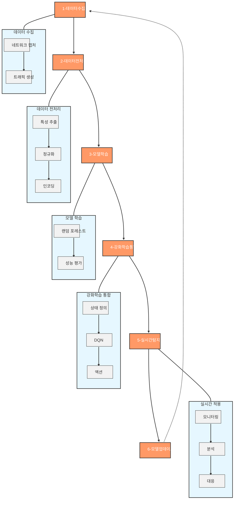
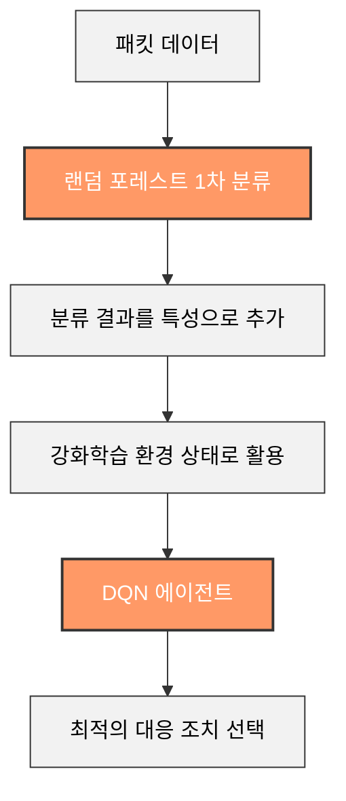
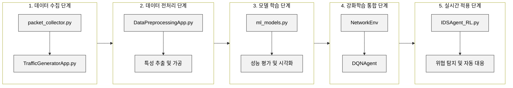
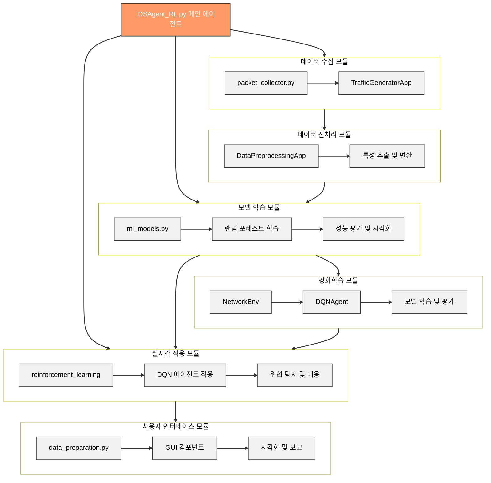

# 반응형 취약점 차단 AI 에이전트

<<<<<<< HEAD
## 0. 목차
[1] [개요](#1-개요)   
[2] [사용한 모듈](#2-사용한-모듈)   
[3] [학습 방법](#3-학습-방법)   
[4] [프로그램 작동](#4-프로그램-작동)   
[5] [AI 에이전트 함수](#5-ai-에이전트-함수)   

## 1. 개요
AI 에이전트가 네트워크 보안 취약점 학습(차단) 하는 시스템입니다.

[팀]   
**안상수** : 팀장, 설계, 프로그래밍   
**신명재** : 테이터 학습, 문서작업, 프로그래밍   
**최준형** : 테이터 학습, 이미지 시각화   
**민인영** : 데이터 학습, 웹 제작   

## 2. 사용한 모듈
[1] [메인 모듈](#1-메인-모듈)   
[2] [서브 모듈](#2-서브-모듈)   
=======
<div align="center">
  
  
  
</div>

## 📑 목차
- [📌 개요](#-개요)
- [👥 팀원 정보](#-팀원-정보)
- [🏗️ 프로젝트 구조](#️-프로젝트-구조)
- [🛠️ 사용된 모듈 및 라이브러리](#️-사용된-모듈-및-라이브러리)
- [🔄 AI 에이전트 작동 방식](#-ai-에이전트-작동-방식)
- [🌟 하이브리드 접근 방식의 특징](#-하이브리드-접근-방식의-특징)
- [💻 주요 시스템 구성 요소](#-주요-시스템-구성-요소)
- [🧠 강화학습 관련 클래스 및 메서드](#-강화학습-관련-클래스-및-메서드)
- [🔄 모듈 간 통합 및 데이터 흐름](#-모듈-간-통합-및-데이터-흐름) 
- [🏗️ 전체 시스템 아키텍처](#️-전체-시스템-아키텍처)
- [📋 프로그램 작동법](#-프로그램-작동법)
- [🔮 향후 개발 계획](#-향후-개발-계획)

## 📌 개요
AI 에이전트가 시스템의 네트워크 보안 취약점을 찾아 위험 요소를 학습 및 차단하는 시스템입니다. 랜덤 포레스트(Random Forest)와 강화학습(Reinforcement Learning)을 결합한 하이브리드 접근 방식을 사용하여 더 높은 탐지율과 적응성을 제공합니다.

## 👥 팀원 정보
>>>>>>> d171c4560085ce13584963f9314e0cc174066770

### (1) 메인 모듈
- [데이터 분석]
    - **pandas (pd)** : 구조화된 데이터를 분석, 처리하는 라이브러리
    - **numpy (np)** : 행열 데이터를 분석, 처리하는 라이브러리
- [머신러닝]
    - **sklearn** : 모델 학습, 예측, 정확도 평가, 트래픽 분류 라이브러리
    - **joblib** : 머신러닝 모델을 저장/로드에 최적화된 라이브러리
- [시각화]
    - **matplotlib (plt)** : 2D 그래프, 차트 생성 라이브러리
    - **seaborn (sns)** : 통계 데이터, 혼동행렬 시각화 라이브러리
- [네트워크]
    - **socket** : 저수준 네트워크 통신을 구현할 수 있는 라이브러리
    - **scapy** : 네트워크 보안 및 트래픽 처리용 라이브러리
- [운영체제(시스템)]
    - **os** : 운영체제 터미널 라이브러리
    - **sys** : 인터프리터, 기본적인 기능을 제공하는 표준 라이브러리
    - **ctypes** : C언어 라이브러리를 파이썬에서 작동되게 하는 라이브러리
    - **psutil** :
    - **winreg** :
- [멀티 스레딩]
    - 
- [GUI]
    - 
- [유틸리티]
    - 
- [터미널]
    - 

<<<<<<< HEAD
### (2) 서브 모듈
- [머신러닝]
    - **sklearn**
        - RandomForestClassifier : 랜덤으로 샘플링하여 훈련세트 만들어 학습
        - train_test_split : 데이터를 학습용과 테스트용으로 자동 분할
        - accuracy_score : 예측한 값이 얼마나 일치하는지 백분율로 계산
        - confusion matrix : 예측한 값이 얼마나 정확하게 분류했는지 계산
        - StandardScaler : 평균 0, 표준편차 1로 모든 특성 값 표준화
        - LabelEncoder : 문자형 데이터를 정수형 숫자로 변환
- [시각화]
    - **matplotlib**
        - FigureCanvasTkAgg : 
        - Figure : 
        - 

- **matplotlib.backends.backend_tkagg.FigureCanvasTkAgg**: Tkinter GUI에 matplotlib 그림을 표시하기 위한 클래스
- **matplotlib.figure.Figure**: matplotlib 그림 객체 생성

### 네트워크 및 패킷 캡처 관련 모듈
- **scapy.all.sniff, IP, TCP, UDP, ICMP**: 패킷 캡처 및 분석을 위한 라이브러리
- **scapy.layers.inet.IP, TCP**: IP 및 TCP 프로토콜 처리
- **scapy.sendrecv.sr1, send**: 패킷 전송 및 응답 수신 기능

### 시스템 및 OS 관련 모듈
- **psutil**: 시스템 모니터링. 네트워크 인터페이스 정보 획득에 사용
- **winreg**: Windows 레지스트리 접근. Npcap 설치 확인에 사용

### 멀티스레딩 및 동시성 관련 모듈
- **threading**: 멀티스레딩 구현. 패킷 캡처, 분석, 모니터링 등을 병렬로 처리
- **queue**: 스레드 간 데이터 전달을 위한 큐. 패킷 정보 저장 및 처리에 사용
=======
## 🏗️ 프로젝트 구조

```
Intrusion_DetectionSystem/
├── IDSAgent_RL.py 
├── scripts/
│   ├── data_preparation.py 
│   ├── components/
│   │   ├── packet_collector.py
│   │   ├── TrafficGeneratorApp.py
│   │   └── DataPreprocessingApp.py
├── modules/
│   ├── reinforcement_learning.py
│   ├── ml_models.py
│   ├── packet_capture.py
│   └── utils.py
```

## 🛠️ 사용된 모듈 및 라이브러리

### 데이터 처리 및 분석 관련 모듈
- **pandas**: 데이터 구조 및 분석을 위한 라이브러리
- **numpy**: 수치 계산을 위한 라이브러리

### 머신러닝 관련 모듈
- **scikit-learn**: 랜덤 포레스트 분류, 모델 평가, 데이터 전처리 등
- **joblib**: 모델을 파일로 저장하고 로드하는 데 사용

### 강화학습 관련 모듈
- **PyTorch**: 딥러닝 프레임워크, DQN 모델 구현
- **Gym**: 강화학습 환경 구축

### 네트워크 및 패킷 캡처 관련 모듈
- **Scapy**: 패킷 캡처, 분석, 생성 및 전송 기능
>>>>>>> d171c4560085ce13584963f9314e0cc174066770

### GUI 관련 모듈
- **PyQt6**: GUI 구현을 위한 Qt 프레임워크의 Python 바인딩

## 🔄 AI 에이전트 작동 방식

### 1. 데이터 수집
- 네트워크 인터페이스에서 실시간으로 패킷을 캡처
- 공격성 트래픽 생성 어플리케이션으로 학습용 데이터 생성

### 2. 데이터 전처리
- 패킷 데이터에서 중요 특성 추출 (출발지 IP, 목적지 IP, 프로토콜, 길이 등)
- 결측치 처리, 데이터 정규화, 범주형 데이터 인코딩

### 3. 모델 학습
- 랜덤 포레스트 알고리즘으로 분류 모델 학습
- 정상 트래픽과 공격성 트래픽을 구분하는 패턴 학습

### 4. 강화학습 통합
- 랜덤 포레스트의 예측 결과를 강화학습 에이전트의 상태(state)로 활용
- DQN(Deep Q-Network)을 통해 최적의 대응 정책 학습
- 액션 공간: 허용(0), 차단(1), 모니터링(2)

### 5. 실시간 탐지 및 차단
- 실시간 네트워크 트래픽 모니터링 및 분석
- DQN 에이전트의 결정에 따른 자동 대응 조치 수행

### 6. 모델 업데이트
- 새로운 데이터를 지속적으로 수집하여 모델 재학습
- 변화하는 네트워크 환경에 적응



<<<<<<< HEAD
## 3. 학습 방법

1. **데이터 수집**:
   - 네트워크 인터페이스에서 실시간으로 패킷을 캡처하여 데이터를 수집합니다. **(사용 라이브러리: Scapy)**
   - 다양한 유형의 트래픽 데이터를 수집하여 학습 데이터셋을 구성합니다.
   - 에이전트 개발 중 자체 제작된 공격성 트래픽 생성 어플리케이션으로 공격성 패킷을 생성 및 전송하여 데이터를 생성합니다.**(사용 라이브러리: Scapy)**
 
=======
## 🌟 하이브리드 접근 방식의 특징

본 시스템은 랜덤 포레스트와 강화학습을 결합한 하이브리드 접근 방식을 사용합니다:



1. **랜덤 포레스트 1차 분류**: 패킷 데이터를 랜덤 포레스트로 1차적으로 분류
2. **랜덤 포레스트 예측 결과 활용**: 분류 결과를 특성(feature)으로 추가
3. **강화학습 환경 통합**: 랜덤 포레스트 예측 결과를 강화학습의 상태(state)로 활용
4. **실시간 대응 의사결정**: DQN 에이전트가 최적의 대응 조치 선택

**장점:**
- 랜덤 포레스트의 높은 분류 정확도 활용
- 강화학습을 통한 동적 환경 적응
- 실시간 의사결정 및 자동화된 대응
- 지속적인 학습을 통한 성능 향상

## 💻 주요 시스템 구성 요소

### IDSAgent_RL 통합 에이전트 (IDSAgent_RL.py)

`IDSAgent_RL.py`는 이 프로젝트의 핵심 파일로, 랜덤 포레스트와 강화학습을 통합하여 네트워크 침입 탐지 및 자동 대응 기능을 제공합니다.

**주요 기능:**
- **통합 인터페이스**: 모든 침입 탐지 및 대응 기능을 단일 인터페이스에서 제공
- **강화학습 통합**: 랜덤 포레스트 예측 결과를 강화학습의 상태로 활용
- **실시간 모니터링**: 네트워크 패킷 실시간 캡처 및 분석
- **자동 대응**: 탐지된 위협에 대한 자동화된 대응 조치 수행

**실행 흐름:**
1. 프로그램 시작 및 환경 초기화
2. 네트워크 인터페이스 선택
3. 패킷 캡처 시작
4. 실시간 모니터링
5. 데이터 저장 및 처리
6. 모델 학습 및 적용
7. 위협 탐지 및 대응

### 데이터 준비 및 처리 모듈 (data_preparation.py)

`data_preparation.py`는 데이터 수집, 생성 및 전처리에 필요한 GUI 인터페이스를 제공합니다.

**MainApplication 클래스:**
- 중앙 위젯 및 스택 위젯을 통한 화면 전환 기능
- 메인 화면, 패킷 캡처, 트래픽 생성, 데이터 전처리 등 기능별 인터페이스

### DataPreprocessingApp 클래스

DataPreprocessingApp은 네트워크 패킷 데이터의 전처리와 분석을 위한 사용자 인터페이스를 제공합니다.

**주요 기능:**
- CSV 또는 PCAP 형식의 데이터 파일 로드
- 테이블 형태로 데이터 시각화
- 자동 전처리 기능 (결측치 처리, 정규화, 인코딩)
- 전처리된 데이터의 CSV 형식 저장

**전처리 파이프라인:**
1. 데이터 로드: CSV 또는 PCAP 파일에서 데이터 로드
2. 기본 정보 추출: 소스 IP, 목적지 IP, 프로토콜, 패킷 길이 등 추출
3. 결측치 처리: 결측값을 0으로 대체
4. 데이터 정규화: 수치형 데이터를 표준화
5. 범주형 데이터 인코딩: 프로토콜과 같은 범주형 데이터를 원-핫 인코딩으로 변환
6. 파일 저장: 전처리된 데이터를 CSV 파일로 저장

### TrafficGeneratorApp 클래스

TrafficGeneratorApp은 다양한 유형의 네트워크 트래픽을 생성하고 전송하는 기능을 제공합니다.

**주요 기능:**
- 대상 IP 지정 및 패킷 크기 선택
- 다양한 공격 유형 선택 (SYN 플러드, UDP 플러드, ICMP 플러드 등)
- 생성할 패킷 수 설정
- 트래픽 생성 및 전송

## 🧠 강화학습 관련 클래스 및 메서드

### NetworkEnv 클래스

NetworkEnv 클래스는 강화학습을 위한 네트워크 환경을 구현합니다.

**주요 특징:**
- **액션 공간**: 허용(0), 차단(1), 모니터링(2)
- **관찰 공간**: 7개의 특성 [src_ip, dst_ip, protocol, length, ttl, flags, rf_prob]
- **랜덤 포레스트 통합**: 모델의 예측 확률을 상태에 통합
- **보상 시스템**: 패킷의 안전성을 판단하여 보상 계산

### DQNAgent 클래스

DQNAgent 클래스는 심층 Q 네트워크를 구현하여 패킷에 대한 최적의 대응 정책을 학습합니다.

**주요 특징:**
- 신경망 모델 구축
- 경험 리플레이를 사용한 학습 안정화
- 타겟 네트워크를 통한 학습 안정성 향상
- 엡실론-그리디 탐험 전략 적용

**학습 프로세스:**
1. 환경에서 상태 관찰
2. 현재 정책에 따라 액션 선택 (탐험 또는 활용)
3. 액션 실행 및 보상 수집
4. 새로운 상태로 전이
5. 경험 메모리에 저장
6. 경험 리플레이를 통한 모델 업데이트

## 🔄 모듈 간 통합 및 데이터 흐름

본 시스템의 데이터 흐름 및 모듈 간 통합은 다음과 같은 과정으로 이루어집니다:



1. **데이터 수집 단계**:
   - `packet_collector.py`를 통해 네트워크 패킷 캡처
   - `TrafficGeneratorApp.py`를 통한 인공 트래픽 생성

2. **데이터 전처리 단계**:
   - `DataPreprocessingApp.py`를 통해 데이터 정제 및 변환
   - 랜덤 포레스트 분류를 위한 특성 추출 및 가공

3. **모델 학습 단계**:
   - `ml_models.py`에서 랜덤 포레스트 모델 학습
   - 학습된 모델의 성능 평가 및 시각화

4. **강화학습 통합 단계**:
   - `reinforcement_learning.py`의 NetworkEnv 환경에서 랜덤 포레스트 예측 결과 활용
   - DQNAgent를 통한 행동 정책 학습

5. **실시간 적용 단계**:
   - `IDSAgent_RL.py`에서 학습된 모델을 실시간 패킷에 적용
   - 잠재적 위협 탐지 및 자동 대응

## 🏗️ 전체 시스템 아키텍처

이 프로젝트의 전체 아키텍처는 데이터 수집, 전처리, 학습 및 실시간 적용의 통합된 파이프라인을 형성합니다:



이러한 통합 아키텍처를 통해 데이터 흐름이 원활하게 이루어지며, 각 모듈의 기능이 유기적으로 연결됩니다. 특히 랜덤 포레스트와 강화학습의 통합은 이 시스템의 핵심 특징으로, 두 알고리즘의 장점을 결합하여 더 높은 탐지 성능과 적응성을 제공합니다.

## 📋 프로그램 작동법

### 데이터 준비 애플리케이션 (DataPreprocessingApp)

1. **데이터 파일 업로드**:
   - 'data_preparation.py'를 실행하여 메인 메뉴에 접근
   - '데이터 전처리' 버튼을 클릭하여 DataPreprocessingApp 실행
   - '데이터 파일 업로드' 버튼으로 CSV 또는 PCAP 파일 선택
   - 데이터는 자동으로 테이블에 로드되어 표시됨
>>>>>>> d171c4560085ce13584963f9314e0cc174066770

2. **데이터 전처리**:
   - '데이터 전처리' 버튼 클릭
   - 결측치 처리, 정규화, 인코딩 등의 과정이 자동 수행됨
   - 전처리 결과 표시 및 저장 옵션 제공
   - 저장 위치 선택 후 CSV 형식으로 저장

### 침입 탐지 에이전트 (IDSAgent_RL)

1. **환경 확인**: Google Colab 환경과 로컬 환경에서 다르게 작동
2. **관리자 권한 실행**: Windows 환경에서는 관리자 권한으로 실행
3. **패킷 캡처**: 네트워크 인터페이스 선택 및 캡처 시작
4. **실시간 모니터링**: 패킷 캡처 상태와 정보를 실시간으로 모니터링
5. **데이터 저장 및 전처리**: 패킷 데이터 주기적 저장 및 전처리
6. **머신러닝 모델 학습**: 전처리된 데이터로 모델 학습 및 평가

### 트래픽 생성 (TrafficGeneratorApp)

1. **공격성 패킷 생성**:
   - 'data_preparation.py'에서 '트래픽 생성' 버튼 클릭
   - 공격 대상 IP 입력
   - 패킷 크기 및 유형 선택
   - 생성할 패킷 수 설정
   - '생성 시작' 버튼으로 트래픽 생성 및 전송

## 🔮 향후 개발 계획

<<<<<<< HEAD

**Main.App.py : 패킷 캡쳐 및 공격성 패킷 생성 기능을 구현한 어플리케이션**

**AI_agent : 이 프로젝트에서 학습시키고 구현하고자 한 기능을 넣을 어플리케이션**

## 4. 프로그램 작동

**관리자 권한 실행** : windows 환경에서는 관리자 권한으로 실행해야합니다. 프로그램이 자동으로 관리자 권한으로 재실행 됩니다.

**패킷 캡쳐 기능** 
   1.프로그램이 자동으로 사용가능한 인터페이스를 인식하여 선택합니다.(개발 도중은 wifi로 고정)
   2.캡쳐할 패킷의 수를 텍스트 박스에서 설정 후 패킷 캡쳐를 실행
   3.캡쳐된 패킷 데이터를 저장

**데이터 전처리**
   1. 전처리할 패킷 데이터를 데이터파일 업로드 버튼을 통해 선택합니다.
   2. 패킷 데이터를 전처리 후 데이터 파일을 저장합니다.

**트래픽생성(공격성)**
   1. 공격성 패킷을 보낼 ip를 입력합니다. 
   2. 패킷의 크기를 선택합니다.
   3. 공격의 유형을 선택합니다.(기본 프리셋 제공)
   4. 보낼 패킷의 수 설정
   5. 트래픽 생성 및 전송(공격)


## 프로그램 작동법(AI_agent)

1. **환경 확인**: 프로그램은 Google Colab 환경과 로컬 환경에서 다르게 작동합니다. Colab에서는 머신러닝 모델 학습만 가능하며, 포트 스캔 및 패킷 캡처는 로컬 환경에서만 가능합니다.
2. **관리자 권한 실행**: Windows 환경에서는 관리자 권한으로 실행해야 합니다. 프로그램이 자동으로 관리자 권한으로 재실행됩니다.
3. **패킷 캡처**: 네트워크 인터페이스를 선택하여 패킷 캡처를 시작합니다. Npcap이 설치되어 있어야 하며, 개발 중 와이파이 인터페이스를 자동으로 선택합니다.
4. **실시간 모니터링**: 패킷 캡처 상태와 캡처된 패킷 정보를 실시간으로 모니터링합니다.
5. **데이터 저장 및 전처리**: 캡처된 패킷 데이터를 주기적으로 CSV 파일로 저장하고 전처리합니다.
6. **머신러닝 모델 학습**: 전처리된 데이터를 사용하여 머신러닝 모델을 학습하고 평가합니다. 모델은 RandomForestClassifier를 사용하며, 학습 결과는 웹과 연동되어 시각화됩니다.

## 5. AI 에이전트 함수

### 주요 함수 및 기능

- `is_colab()`: Google Colab 환경인지 확인합니다.
- `is_admin()`: Windows에서 관리자 권한을 확인합니다.
- `run_as_admin()`: 관리자 권한으로 프로그램을 재실행합니다.
- `clear_screen()`: 화면을 지웁니다.
- `wait_for_enter()`: Enter 키를 누를 때까지 대기합니다.
- `print_scan_status(port, status, start_time)`: 스캔 상태를 실시간으로 출력합니다.
- `syn_scan(target_ip, ports)`: TCP SYN 스캔을 수행합니다.

### PacketCapture 클래스

**속성:**
- `interface`: 패킷을 캡처할 네트워크 인터페이스.
- `count`: 캡처할 패킷의 수.

**메서드:**
- `capture_packets()`: 지정된 인터페이스에서 패킷을 캡처합니다.
- `preprocess_packets(packets)`: 캡처된 패킷을 DataFrame으로 전처리합니다.
- `_get_packet_info(packet)`: 패킷의 상세 정보를 추출합니다.
- `_get_tcp_flags(flags)`: TCP 플래그를 추출합니다.
- `save_to_csv(dataframe, filename)`: DataFrame을 CSV 파일로 저장합니다.

### PacketCaptureCore 클래스

**속성:**
- `packet_queue`: 캡처된 패킷을 저장하는 큐.
- `is_running`: 캡처 상태를 나타내는 플래그.
- `packet_count`: 캡처된 패킷의 수.
- `max_packets`: 최대 캡처할 패킷의 수.
- `sniff_thread`: 패킷 캡처를 위한 스레드.
- `capture_completed`: 캡처 완료 상태를 나타내는 플래그.

**메서드:**
- `check_npcap()`: Npcap 설치 여부를 확인합니다.
- `get_network_interfaces()`: 네트워크 인터페이스 목록을 반환합니다.
- `start_capture(interface, max_packets)`: 패킷 캡처를 시작합니다.
- `stop_capture()`: 패킷 캡처를 중지합니다.
- `get_packet_queue()`: 패킷 큐를 반환합니다.
- `get_packet_count()`: 캡처된 패킷 수를 반환합니다.
- `get_packet_dataframe()`: 패킷 큐에 있는 데이터를 DataFrame으로 변환합니다.
- `_process_packet(packet)`: 캡처된 패킷을 처리합니다.

### MLTrainingWindow 클래스

**속성:**
- `root`: Tkinter 루트 윈도우.
- `status_frame`: 학습 상태를 표시하는 프레임.
- `log_frame`: 학습 로그를 표시하는 프레임.
- `metrics_frame`: 성능 지표를 표시하는 프레임.
- `confusion_frame`: 혼동 행렬을 표시하는 프레임.
- `gui_queue`: GUI 업데이트를 위한 큐.

**메서드:**
- `process_gui_queue()`: GUI 큐를 처리하여 상태를 업데이트합니다.
- `show()`: GUI를 표시합니다.
- `update_status()`: 상태를 업데이트합니다.
- `update_metrics()`: 성능 지표를 업데이트합니다.

### 기타 기능

- `main()`: 프로그램의 메인 함수로, Colab 환경 확인, 관리자 권한 확인, 패킷 캡처 시작, 머신러닝 학습 모니터링 등을 수행합니다.

## 에이전트 구조

```
+-----------------------+
|   PacketCapture       |
+-----------------------+
| - interface           |
| - count               |
|-----------------------|
| + capture_packets()   |
| + preprocess_packets()|
| + _get_packet_info()  |
| + _get_tcp_flags()    |
| + save_to_csv()       |
+-----------------------+
         |
         v
+-----------------------+
|   PacketCaptureCore   |
+-----------------------+
| - packet_queue        |
| - is_running          |
| - packet_count        |
| - max_packets         |
| - sniff_thread        |
| - capture_completed   |
|-----------------------|
| + check_npcap()       |
| + get_network_interfaces() |
| + start_capture()     |
| + stop_capture()      |
| + get_packet_queue()  |
| + get_packet_count()  |
| + get_packet_dataframe() |
| + _process_packet()   |
+-----------------------+
         |
         v
+-----------------------+
|   MLTrainingWindow    |
+-----------------------+
| - root                |
| - status_frame        |
| - log_frame           |
| - metrics_frame       |
| - confusion_frame     |
| - gui_queue           |
|-----------------------|
| + process_gui_queue() |
| + show()              |
| + update_status()     |
| + update_metrics()    |
+-----------------------+
```
=======
- PPO(Proximal Policy Optimization) 알고리즘 구현
- 다양한 네트워크 환경에서의 적응성 향상
- 분산 학습 시스템 구축
- 실시간 대응 메커니즘 고도화
- 사용자 피드백 기반 성능 최적화
>>>>>>> d171c4560085ce13584963f9314e0cc174066770
