@ -1,332 +1,332 @@
# 반응형 취약점 차단 AI 에이전트

<div align="center">
  
  
  
</div>

## 📑 목차
- [📌 개요](#-개요)
- [👥 팀원 정보](#-팀원-정보)
- [🏗️ 프로젝트 구조](#️-프로젝트-구조)
- [🛠️ 사용된 모듈 및 라이브러리](#️-사용된-모듈-및-라이브러리)
- [🔄 AI 에이전트 작동 방식](#-ai-에이전트-작동-방식)
- [🌟 하이브리드 접근 방식의 특징](#-하이브리드-접근-방식의-특징)
- [💻 주요 시스템 구성 요소](#-주요-시스템-구성-요소)
- [🧠 강화학습 관련 클래스 및 메서드](#-강화학습-관련-클래스-및-메서드)
- [🔄 모듈 간 통합 및 데이터 흐름](#-모듈-간-통합-및-데이터-흐름) 
- [🏗️ 전체 시스템 아키텍처](#️-전체-시스템-아키텍처)
- [📋 프로그램 작동법](#-프로그램-작동법)
- [🔮 향후 개발 계획](#-향후-개발-계획)

## 📌 개요
AI 에이전트가 시스템의 네트워크 보안 취약점을 찾아 위험 요소를 학습 및 차단하는 시스템입니다. 랜덤 포레스트(Random Forest)와 강화학습(Reinforcement Learning)을 결합한 하이브리드 접근 방식을 사용하여 더 높은 탐지율과 적응성을 제공합니다.

## 👥 팀원 정보

- **안상수**: 팀장, 시스템 설계, 메인프로그래밍
- **신명재**: 데이터 학습 및 문서작업
- **민인영**: 데이터 학습 및 이미지 시각화
- **최준형**: 데이터 학습 및 백엔드작업

## 🏗️ 프로젝트 구조

```
Intrusion_DetectionSystem/
├── IDSAgent_RL.py 
├── scripts/
│   ├── data_preparation.py 
│   ├── components/
│   │   ├── packet_collector.py
│   │   ├── TrafficGeneratorApp.py
│   │   └── DataPreprocessingApp.py
├── modules/
│   ├── reinforcement_learning.py
│   ├── ml_models.py
│   ├── packet_capture.py
│   └── utils.py
```

## 🛠️ 사용된 모듈 및 라이브러리

### 데이터 처리 및 분석 관련 모듈
- **pandas**: 데이터 구조 및 분석을 위한 라이브러리
- **numpy**: 수치 계산을 위한 라이브러리

### 머신러닝 관련 모듈
- **scikit-learn**: 랜덤 포레스트 분류, 모델 평가, 데이터 전처리 등
- **joblib**: 모델을 파일로 저장하고 로드하는 데 사용

### 강화학습 관련 모듈
- **PyTorch**: 딥러닝 프레임워크, DQN 모델 구현
- **Gym**: 강화학습 환경 구축

### 네트워크 및 패킷 캡처 관련 모듈
- **Scapy**: 패킷 캡처, 분석, 생성 및 전송 기능

### GUI 관련 모듈
- **PyQt6**: GUI 구현을 위한 Qt 프레임워크의 Python 바인딩

## 🔄 AI 에이전트 작동 방식

```mermaid
flowchart TD
    A("데이터 수집") --> B("데이터 전처리")
    B --> C("모델 학습")
    C --> D("강화학습 통합")
    D --> E("실시간 탐지")
    E --> F("모델 업데이트")
    F -.-> A
    
    classDef main fill:#f96,color:#fff,stroke:#333,stroke-width:1px;
    class A,B,C,D,E,F main;
```



## 🌟 하이브리드 접근 방식의 특징

본 시스템은 랜덤 포레스트와 강화학습을 결합한 하이브리드 접근 방식을 사용합니다:

```mermaid
flowchart TD
    A("패킷 데이터") --> B("랜덤 포레스트 1차 분류")
    B --> C("분류 결과를 특성으로 추가")
    C --> D("강화학습 환경 상태로 활용")
    D --> E("DQN 에이전트")
    E --> F("최적의 대응 조치 선택")
    
    classDef primary fill:#f96,color:#fff,stroke:#333,stroke-width:2px;
    classDef secondary fill:#f2f2f2,color:#000,stroke:#333,stroke-width:1px;
    
    class B,E primary;
    class A,C,D,F secondary;
```



1. **랜덤 포레스트 1차 분류**: 패킷 데이터를 랜덤 포레스트로 1차적으로 분류
2. **랜덤 포레스트 예측 결과 활용**: 분류 결과를 특성(feature)으로 추가
3. **강화학습 환경 통합**: 랜덤 포레스트 예측 결과를 강화학습의 상태(state)로 활용
4. **실시간 대응 의사결정**: DQN 에이전트가 최적의 대응 조치 선택

**장점:**
- 랜덤 포레스트의 높은 분류 정확도 활용
- 강화학습을 통한 동적 환경 적응
- 실시간 의사결정 및 자동화된 대응
- 지속적인 학습을 통한 성능 향상

## 💻 주요 시스템 구성 요소

### IDSAgent_RL 통합 에이전트 (IDSAgent_RL.py)

`IDSAgent_RL.py`는 이 프로젝트의 핵심 파일로, 랜덤 포레스트와 강화학습을 통합하여 네트워크 침입 탐지 및 자동 대응 기능을 제공합니다.

**주요 기능:**
- **통합 인터페이스**: 모든 침입 탐지 및 대응 기능을 단일 인터페이스에서 제공
- **강화학습 통합**: 랜덤 포레스트 예측 결과를 강화학습의 상태로 활용
- **실시간 모니터링**: 네트워크 패킷 실시간 캡처 및 분석
- **자동 대응**: 탐지된 위협에 대한 자동화된 대응 조치 수행

**실행 흐름:**
1. 프로그램 시작 및 환경 초기화
2. 네트워크 인터페이스 선택
3. 패킷 캡처 시작
4. 실시간 모니터링
5. 데이터 저장 및 처리
6. 모델 학습 및 적용
7. 위협 탐지 및 대응

### 데이터 준비 및 처리 모듈 (data_preparation.py)

`data_preparation.py`는 데이터 수집, 생성 및 전처리에 필요한 GUI 인터페이스를 제공합니다.

**MainApplication 클래스:**
- 중앙 위젯 및 스택 위젯을 통한 화면 전환 기능
- 메인 화면, 패킷 캡처, 트래픽 생성, 데이터 전처리 등 기능별 인터페이스

### DataPreprocessingApp 클래스

DataPreprocessingApp은 네트워크 패킷 데이터의 전처리와 분석을 위한 사용자 인터페이스를 제공합니다.

**주요 기능:**
- CSV 또는 PCAP 형식의 데이터 파일 로드
- 테이블 형태로 데이터 시각화
- 자동 전처리 기능 (결측치 처리, 정규화, 인코딩)
- 전처리된 데이터의 CSV 형식 저장

**전처리 파이프라인:**
1. 데이터 로드: CSV 또는 PCAP 파일에서 데이터 로드
2. 기본 정보 추출: 소스 IP, 목적지 IP, 프로토콜, 패킷 길이 등 추출
3. 결측치 처리: 결측값을 0으로 대체
4. 데이터 정규화: 수치형 데이터를 표준화
5. 범주형 데이터 인코딩: 프로토콜과 같은 범주형 데이터를 원-핫 인코딩으로 변환
6. 파일 저장: 전처리된 데이터를 CSV 파일로 저장

### TrafficGeneratorApp 클래스

TrafficGeneratorApp은 다양한 유형의 네트워크 트래픽을 생성하고 전송하는 기능을 제공합니다.

**주요 기능:**
- 대상 IP 지정 및 패킷 크기 선택
- 다양한 공격 유형 선택 (SYN 플러드, UDP 플러드, ICMP 플러드 등)
- 생성할 패킷 수 설정
- 트래픽 생성 및 전송

## 🧠 강화학습 관련 클래스 및 메서드

### NetworkEnv 클래스

NetworkEnv 클래스는 강화학습을 위한 네트워크 환경을 구현합니다.

**주요 특징:**
- **액션 공간**: 허용(0), 차단(1), 모니터링(2)
- **관찰 공간**: 7개의 특성 [src_ip, dst_ip, protocol, length, ttl, flags, rf_prob]
- **랜덤 포레스트 통합**: 모델의 예측 확률을 상태에 통합
- **보상 시스템**: 패킷의 안전성을 판단하여 보상 계산

### DQNAgent 클래스

DQNAgent 클래스는 심층 Q 네트워크를 구현하여 패킷에 대한 최적의 대응 정책을 학습합니다.

**주요 특징:**
- 신경망 모델 구축
- 경험 리플레이를 사용한 학습 안정화
- 타겟 네트워크를 통한 학습 안정성 향상
- 엡실론-그리디 탐험 전략 적용

**학습 프로세스:**
1. 환경에서 상태 관찰
2. 현재 정책에 따라 액션 선택 (탐험 또는 활용)
3. 액션 실행 및 보상 수집
4. 새로운 상태로 전이
5. 경험 메모리에 저장
6. 경험 리플레이를 통한 모델 업데이트

## 🔄 모듈 간 통합 및 데이터 흐름

본 시스템의 데이터 흐름 및 모듈 간 통합은 다음과 같은 과정으로 이루어집니다:

```mermaid
flowchart LR
    subgraph 데이터수집["1. 데이터 수집 단계"]
        packet["packet_collector.py"]
        traffic["TrafficGeneratorApp.py"]
        packet --> traffic
    end

    subgraph 전처리["2. 데이터 전처리 단계"]
        preprocess["DataPreprocessingApp.py"]
        feature["특성 추출 및 가공"]
        preprocess --> feature
    end

    subgraph 모델학습["3. 모델 학습 단계"]
        ml["ml_models.py"]
        evaluation["성능 평가 및 시각화"]
        ml --> evaluation
    end

    subgraph 강화학습["4. 강화학습 통합 단계"]
        env["NetworkEnv"]
        dqn["DQNAgent"]
        env --> dqn
    end

    subgraph 실시간적용["5. 실시간 적용 단계"]
        agent["IDSAgent_RL.py"]
        response["위협 탐지 및 자동 대응"]
        agent --> response
    end

    데이터수집 --> 전처리
    전처리 --> 모델학습
    모델학습 --> 강화학습
    강화학습 --> 실시간적용
    
    classDef nodeText fill:#f2f2f2,stroke:#333,stroke-width:1px,color:black;
    class packet,traffic,preprocess,feature,ml,evaluation,env,dqn,agent,response nodeText;
    
    classDef subgraphText fill:transparent,color:black;
    class 데이터수집,전처리,모델학습,강화학습,실시간적용 subgraphText;
```

1. **데이터 수집 단계**:
   - `packet_collector.py`를 통해 네트워크 패킷 캡처
   - `TrafficGeneratorApp.py`를 통한 인공 트래픽 생성

2. **데이터 전처리 단계**:
   - `DataPreprocessingApp.py`를 통해 데이터 정제 및 변환
   - 랜덤 포레스트 분류를 위한 특성 추출 및 가공

3. **모델 학습 단계**:
   - `ml_models.py`에서 랜덤 포레스트 모델 학습
   - 학습된 모델의 성능 평가 및 시각화

4. **강화학습 통합 단계**:
   - `reinforcement_learning.py`의 NetworkEnv 환경에서 랜덤 포레스트 예측 결과 활용
   - DQNAgent를 통한 행동 정책 학습

5. **실시간 적용 단계**:
   - `IDSAgent_RL.py`에서 학습된 모델을 실시간 패킷에 적용
   - 잠재적 위협 탐지 및 자동 대응

## 🏗️ 전체 시스템 아키텍처

이 프로젝트의 전체 아키텍처는 데이터 수집, 전처리, 학습 및 실시간 적용의 통합된 파이프라인을 형성합니다:

```mermaid
flowchart TB
    main["IDSAgent_RL.py 메인 에이전트"]
    
    main --> data
    main --> model
    main --> realtime
    
    %% 모듈 배치
    subgraph data["데이터 수집 모듈"]
        direction LR
        collector["packet_collector.py"] --> generator["TrafficGeneratorApp"]
    end
    
    subgraph preprocess["데이터 전처리 모듈"]
        direction LR
        preprocessing["DataPreprocessingApp"] --> features["특성 추출 및 변환"]
    end
    
    subgraph model["모델 학습 모듈"]
        direction LR
        ml["ml_models.py"] --> rf["랜덤 포레스트 학습"] --> eval["성능 평가 및 시각화"]
    end
    
    subgraph rl["강화학습 모듈"]
        direction LR
        env["NetworkEnv"] --> agent["DQNAgent"] --> train["모델 학습 및 평가"]
    end
    
    subgraph realtime["실시간 적용 모듈"]
        direction LR
        reinforce["reinforcement_learning"] --> dqn["DQN 에이전트 적용"] --> detect["위협 탐지 및 대응"]
    end
    
    subgraph ui["사용자 인터페이스 모듈"]
        direction LR
        prep["data_preparation.py"] --> components["GUI 컴포넌트"] --> visual["시각화 및 보고"]
    end
    
    %% 모듈 간 연결
    data --> preprocess
    preprocess --> model
    model --> realtime
    model --> rl
    rl --> realtime
    realtime --> ui
    
    %% 스타일 정의
    classDef moduleHeader fill:#f96,stroke:#333,stroke-width:2px,color:white;
    class main moduleHeader
    
    classDef nodeText fill:#f2f2f2,stroke:#333,stroke-width:1px,color:white;
    classDef nodeText fill:#f2f2f2,stroke:#333,stroke-width:1px,color:black;
    class collector,generator,preprocessing,features,ml,rf,eval,env,agent,train,reinforce,dqn,detect,prep,components,visual nodeText;
    
    classDef subgraphText fill:transparent,color:black;
    classDef subgraphText fill:transparent,color:white;
    class data,preprocess,model,rl,realtime,ui subgraphText;
    
    linkStyle default stroke:#333,stroke-width:2px;
