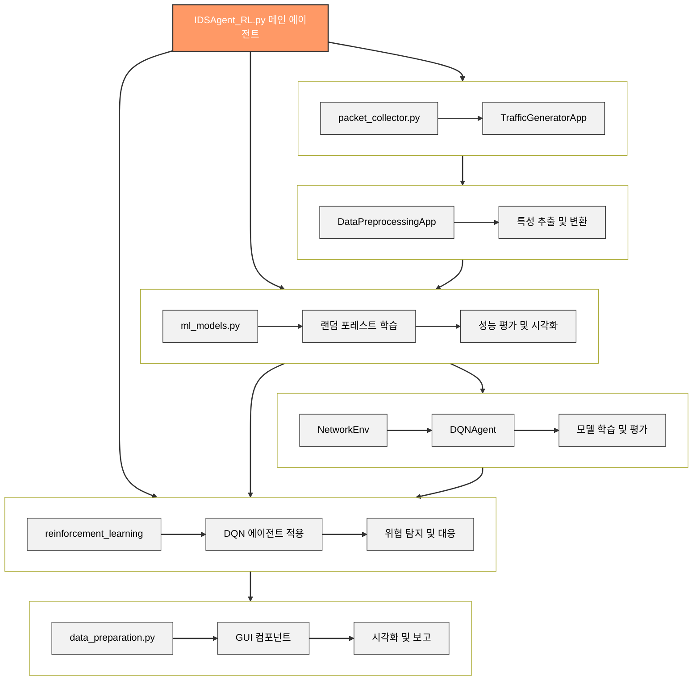

# 반응형 취약점 차단 AI 에이전트

<div align="center">
  
  
  
</div>

## 0. 📑 목차

- 1. [📌 프로젝트 개요](#1.-프로젝트-개요)
- 2. [👥 팀원 정보](#-팀원-정보)
- 3. [🏗️ 프로젝트 구조](#️-프로젝트-구조)
- 4. [🛠️ 사용된 모듈 및 라이브러리](#️-사용된-모듈-및-라이브러리)
- 5. [🔄 AI 에이전트 작동 방식](#-ai-에이전트-작동-방식)
- 6. [🌟 하이브리드 접근 방식의 특징](#-하이브리드-접근-방식의-특징)
- 7. [💻 주요 시스템 구성 요소](#-주요-시스템-구성-요소)
- 8. [🧠 강화학습 관련 클래스 및 메서드](#-강화학습-관련-클래스-및-메서드)
- 9. [🔄 모듈 간 통합 및 데이터 흐름](#-모듈-간-통합-및-데이터-흐름)
- 10. [🏗️ 전체 시스템 아키텍처](#️-전체-시스템-아키텍처)
- 11. [📋 프로그램 작동법](#-프로그램-작동법)
- 12. [🔮 향후 개발 계획](#-향후-개발-계획)

## 1. 📌프로젝트 개요

AI 에이전트가 시스템의 네트워크 보안 취약점을 찾아 위험 요소를 학습 및 차단하는 시스템입니다.
랜덤 포레스트(Random Forest)와 강화학습(Reinforcement Learning)을 결합한 하이브리드 접근 방식을 사용하여 더 높은 탐지율과 적응성을 제공합니다.

## 2. 👥팀원 정보

- **안상수**: 팀장, 시스템 설계, 메인프로그래밍
- **신명재**: 데이터 학습 및 문서작업
- **민인영**: 데이터 학습 및 이미지 시각화
- **최준형**: 데이터 학습 및 백엔드작업

## 3. 🏗️프로젝트 구조

```
Intrusion_DetectionSystem/
├── IDSAgent_RL.py 
├── scripts/
│   ├── data_preparation.py 
│   ├── components/
│   │   ├── packet_collector.py
│   │   ├── TrafficGeneratorApp.py
│   │   └── DataPreprocessingApp.py
├── modules/
│   ├── reinforcement_learning.py
│   ├── ml_models.py
│   ├── packet_capture.py
│   └── utils.py
```

## 🛠️ 사용된 모듈 및 라이브러리

### 데이터 처리 및 분석 모듈
- **pandas**: 데이터 구조 및 분석을 위한 라이브러리
- **numpy**: 수치 계산을 위한 라이브러리

### 머신러닝 관련 모듈
- **scikit-learn**: 랜덤 포레스트 분류, 모델 평가, 데이터 전처리 등
- **joblib**: 모델을 파일로 저장하고 로드하는 데 사용

### 강화학습 관련 모듈
- **PyTorch**: 딥러닝 프레임워크, DQN 모델 구현
- **Gym**: 강화학습 환경 구축

### 네트워크 및 패킷 캡처 관련 모듈
- **Scapy**: 패킷 캡처, 분석, 생성 및 전송 기능

### GUI 관련 모듈
- **PyQt6**: GUI 구현을 위한 Qt 프레임워크의 Python 바인딩

## 🔄 AI 에이전트 작동 방식


## 🌟 하이브리드 접근 방식의 특징

본 시스템은 랜덤 포레스트와 강화학습을 결합한 하이브리드 접근 방식을 사용합니다:


1. **랜덤 포레스트 1차 분류**: 패킷 데이터를 랜덤 포레스트로 1차적으로 분류
2. **랜덤 포레스트 예측 결과 활용**: 분류 결과를 특성(feature)으로 추가
3. **강화학습 환경 통합**: 랜덤 포레스트 예측 결과를 강화학습의 상태(state)로 활용
4. **실시간 대응 의사결정**: DQN 에이전트가 최적의 대응 조치 선택

**장점:**
- 랜덤 포레스트의 높은 분류 정확도 활용
- 강화학습을 통한 동적 환경 적응
- 실시간 의사결정 및 자동화된 대응
- 지속적인 학습을 통한 성능 향상

## 💻 주요 시스템 구성 요소

### IDSAgent_RL 통합 에이전트 (IDSAgent_RL.py)

`IDSAgent_RL.py`는 이 프로젝트의 핵심 파일로, 랜덤 포레스트와 강화학습을 통합하여 네트워크 침입 탐지 및 자동 대응 기능을 제공합니다.

**주요 기능:**
- **통합 인터페이스**: 모든 침입 탐지 및 대응 기능을 단일 인터페이스에서 제공
- **강화학습 통합**: 랜덤 포레스트 예측 결과를 강화학습의 상태로 활용
- **실시간 모니터링**: 네트워크 패킷 실시간 캡처 및 분석
- **자동 대응**: 탐지된 위협에 대한 자동화된 대응 조치 수행

**실행 흐름:**
1. 프로그램 시작 및 환경 초기화
2. 네트워크 인터페이스 선택
3. 패킷 캡처 시작
4. 실시간 모니터링
5. 데이터 저장 및 처리
6. 모델 학습 및 적용
7. 위협 탐지 및 대응

### 데이터 준비 및 처리 모듈 (data_preparation.py)

`data_preparation.py`는 데이터 수집, 생성 및 전처리에 필요한 GUI 인터페이스를 제공합니다.

**MainApplication 클래스:**
- 중앙 위젯 및 스택 위젯을 통한 화면 전환 기능
- 메인 화면, 패킷 캡처, 트래픽 생성, 데이터 전처리 등 기능별 인터페이스

### DataPreprocessingApp 클래스

DataPreprocessingApp은 네트워크 패킷 데이터의 전처리와 분석을 위한 사용자 인터페이스를 제공합니다.

**주요 기능:**
- CSV 또는 PCAP 형식의 데이터 파일 로드
- 테이블 형태로 데이터 시각화
- 자동 전처리 기능 (결측치 처리, 정규화, 인코딩)
- 전처리된 데이터의 CSV 형식 저장

**전처리 파이프라인:**
1. 데이터 로드: CSV 또는 PCAP 파일에서 데이터 로드
2. 기본 정보 추출: 소스 IP, 목적지 IP, 프로토콜, 패킷 길이 등 추출
3. 결측치 처리: 결측값을 0으로 대체
4. 데이터 정규화: 수치형 데이터를 표준화
5. 범주형 데이터 인코딩: 프로토콜과 같은 범주형 데이터를 원-핫 인코딩으로 변환
6. 파일 저장: 전처리된 데이터를 CSV 파일로 저장

### TrafficGeneratorApp 클래스

TrafficGeneratorApp은 다양한 유형의 네트워크 트래픽을 생성하고 전송하는 기능을 제공합니다.

**주요 기능:**
- 대상 IP 지정 및 패킷 크기 선택
- 다양한 공격 유형 선택 (SYN 플러드, UDP 플러드, ICMP 플러드 등)
- 생성할 패킷 수 설정
- 트래픽 생성 및 전송

## 🧠 강화학습 관련 클래스 및 메서드

### NetworkEnv 클래스

NetworkEnv 클래스는 강화학습을 위한 네트워크 환경을 구현합니다.

**주요 특징:**
- **액션 공간**: 허용(0), 차단(1), 모니터링(2)
- **관찰 공간**: 7개의 특성 [src_ip, dst_ip, protocol, length, ttl, flags, rf_prob]
- **랜덤 포레스트 통합**: 모델의 예측 확률을 상태에 통합
- **보상 시스템**: 패킷의 안전성을 판단하여 보상 계산

### DQNAgent 클래스

DQNAgent 클래스는 심층 Q 네트워크를 구현하여 패킷에 대한 최적의 대응 정책을 학습합니다.

**주요 특징:**
- 신경망 모델 구축
- 경험 리플레이를 사용한 학습 안정화
- 타겟 네트워크를 통한 학습 안정성 향상
- 엡실론-그리디 탐험 전략 적용

**학습 프로세스:**
1. 환경에서 상태 관찰
2. 현재 정책에 따라 액션 선택 (탐험 또는 활용)
3. 액션 실행 및 보상 수집
4. 새로운 상태로 전이
5. 경험 메모리에 저장
6. 경험 리플레이를 통한 모델 업데이트

## 🔄 모듈 간 통합 및 데이터 흐름

본 시스템의 데이터 흐름 및 모듈 간 통합은 다음과 같은 과정으로 이루어집니다:


1. **데이터 수집 단계**:
   - `packet_collector.py`를 통해 네트워크 패킷 캡처
   - `TrafficGeneratorApp.py`를 통한 인공 트래픽 생성

2. **데이터 전처리 단계**:
   - `DataPreprocessingApp.py`를 통해 데이터 정제 및 변환
   - 랜덤 포레스트 분류를 위한 특성 추출 및 가공

3. **모델 학습 단계**:
   - `ml_models.py`에서 랜덤 포레스트 모델 학습
   - 학습된 모델의 성능 평가 및 시각화

4. **강화학습 통합 단계**:
   - `reinforcement_learning.py`의 NetworkEnv 환경에서 랜덤 포레스트 예측 결과 활용
   - DQNAgent를 통한 행동 정책 학습

5. **실시간 적용 단계**:
   - `IDSAgent_RL.py`에서 학습된 모델을 실시간 패킷에 적용
   - 잠재적 위협 탐지 및 자동 대응

## 🏗️ 전체 시스템 아키텍처

이 프로젝트의 전체 아키텍처는 데이터 수집, 전처리, 학습 및 실시간 적용의 통합된 파이프라인을 형성합니다:



이러한 통합 아키텍처를 통해 데이터 흐름이 원활하게 이루어지며, 각 모듈의 기능이 유기적으로 연결됩니다. 특히 랜덤 포레스트와 강화학습의 통합은 이 시스템의 핵심 특징으로, 두 알고리즘의 장점을 결합하여 더 높은 탐지 성능과 적응성을 제공합니다.

## 📋 프로그램 작동법

### 데이터 준비 애플리케이션 (DataPreprocessingApp)

1. **데이터 파일 업로드**:
   - 'data_preparation.py'를 실행하여 메인 메뉴에 접근
   - '데이터 전처리' 버튼을 클릭하여 DataPreprocessingApp 실행
   - '데이터 파일 업로드' 버튼으로 CSV 또는 PCAP 파일 선택
   - 데이터는 자동으로 테이블에 로드되어 표시됨

2. **데이터 전처리**:
   - '데이터 전처리' 버튼 클릭
   - 결측치 처리, 정규화, 인코딩 등의 과정이 자동 수행됨
   - 전처리 결과 표시 및 저장 옵션 제공
   - 저장 위치 선택 후 CSV 형식으로 저장

### 침입 탐지 에이전트 (IDSAgent_RL)

1. **환경 확인**: Google Colab 환경과 로컬 환경에서 다르게 작동
2. **관리자 권한 실행**: Windows 환경에서는 관리자 권한으로 실행
3. **패킷 캡처**: 네트워크 인터페이스 선택 및 캡처 시작
4. **실시간 모니터링**: 패킷 캡처 상태와 정보를 실시간으로 모니터링
5. **데이터 저장 및 전처리**: 패킷 데이터 주기적 저장 및 전처리
6. **머신러닝 모델 학습**: 전처리된 데이터로 모델 학습 및 평가

### 트래픽 생성 (TrafficGeneratorApp)

1. **공격성 패킷 생성**:
   - 'data_preparation.py'에서 '트래픽 생성' 버튼 클릭
   - 공격 대상 IP 입력
   - 패킷 크기 및 유형 선택
   - 생성할 패킷 수 설정
   - '생성 시작' 버튼으로 트래픽 생성 및 전송

## 🔮 향후 개발 계획

- PPO(Proximal Policy Optimization) 알고리즘 구현
- 다양한 네트워크 환경에서의 적응성 향상
- 분산 학습 시스템 구축
- 실시간 대응 메커니즘 고도화
- 사용자 피드백 기반 성능 최적화
